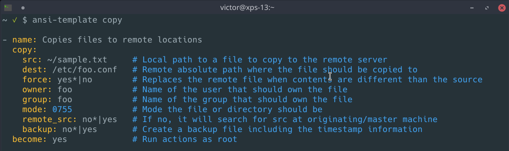

ansible-template
===

Ansible-template is an Ansible module template generator for task files. Give it a module name and it will output a template for that module which can be edited and used on an Ansible task file.

The output text also provides an explanation for each of the module options, as per the [Ansible documentation page](https://docs.ansible.com/ansible/latest/modules/modules_by_category.html)  .



**Usage:**

```
$ ansible-template -h
Usage ansible-template {--no-comment|-n} {--skeleton|-s} [list|module]
```

**See it in action**

[](https://asciinema.org/a/OU5KATKdK9T0nRDbUJ0cr9fY6)

- - -
Options
---

The script provides two additional options to displaying information:

**`--no-comment|-n`**

Removes the comments from the output.

```
$ ansible-template --no-comment copy

- name: Copies files to remote locations
  copy:
    src: ~/sample.txt     
    dest: /etc/foo.conf   
    force: yes*|no        
    owner: foo            
    group: foo            
    mode: 0755            
    remote_src: no*|yes   
    backup: no*|yes       
  become: yes
```

**`--skeleton|-s`**

Removes comment and example values, leaving only the blank module options.

```
$ ansible-template --skeleton copy

- name:
  copy:
    src:
    dest:
    force:
    owner:
    group:
    mode:
    remote_src:
    backup:
  become:
```

Available Modules
---

I'm always trying to add new modules. The currently available modules are:

- archive
- blockinfile
- command
- copy
- fetch
- file
- get_url
- group
- lineinfile
- script
- service
- shell
- synchronize
- systemd
- template
- unarchive
- user


Installation
---

Download `ansible-template.bash` and source it on your `~/.bashrc` or `~/.bash-aliases`.

Requirements
---

+ Bash
+ highlight (optional to display colors)
